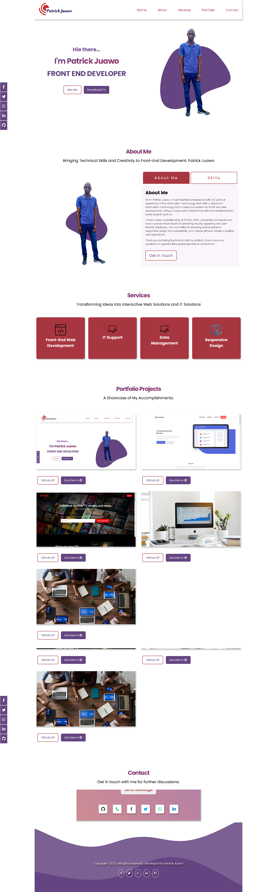
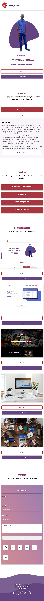

# Project Name - Front-End Portfolio

This is a solution to the [Portfolio Project](https://www.github.com/pjuawo).

## Table of contents

- [Overview](#overview)
  - [The challenge](#the-challenge)
  - [Screenshot](#screenshot)
  - [Links](#links)
- [My process](#my-process)
  - [Built with](#built-with)
  - [What I learned](#what-i-learned)
  - [Continued development](#continued-development)
  - [Useful resources](#useful-resources)
- [Author](#author)

## Overview

### The challenge

Users should be able to:

- View the optimal layout for the site depending on their device's screen size
- See hover states for all interactive elements on the page
- Receive an error message when the contact form is submitted if:
  - The input field is empty
  - The email address is not formatted correctly
- Send direct messenges to different social media handles
- Download my cv in pdf format
- View all my personal projects including live demo and source code

### Screenshot

**Desktop View**



**Mobile View**



### Links

- Solution URL: [https://github.com/pjuawo/portfolio.git](https://github.com/pjuawo/portfolio.git)
- Live Site URL: [https://patrickjuawo-portfolio.netlify.app/](https://patrickjuawo-portfolio.netlify.app/)

## My process

### Built with

- Semantic HTML5 markup
- Mobile-first workflow
- CSS custom properties
- Flexbox
- CSS Grid

### What I learned

```html
<div class="container" id="home">
  <li class="nav__items"><a href="#home">Home</a></li>
</div>
```

```html
<form
  class="message-info"
  action="https://formsubmit.co/pjuawo@gmail.com"
  method="POST"
></form>
```

```html
<div class="contact-icon phone">
  <div class="tooltip">+27813603447</div>
  <span>
    <i class="fa fa-phone"></i>
  </span>
</div>
```

```html
<h1>Some HTML code I'm proud of</h1>
```

```css
--grad: linear-gradient(
  to right bottom,
  #3c4c83,
  #644581,
  #853b74,
  #9d335d,
  #a83640
);
```

```css
--fs-main-heading: clamp(22px, 2.8vw, 40px);
--fs-sub-heading: clamp(20px, 2.8vw, 30px);
--fs-body: clamp(16px, 1.6vw, 22px);
--fs-small: clamp(14px, 1.6vw, 16px);
```

```css
*,
*::before,
*::after {
  box-sizing: border-box;
}
```

```css
@keyframes animateNavItems {
  0% {
    transform: rotateZ(-90deg) rotateX(90deg) scale(0.1);
  }
  100% {
    transform: rotateZ(0deg) rotateX(0deg) scale(1);
    opacity: 1;
  }
}
```

```css
.hero-text--main,
.headings {
  background: var(--grad);
  -webkit-background-clip: text;
  -webkit-text-fill-color: transparent;
  margin: 10px;
  letter-spacing: -0.1rem;
}
```

```css
.skills-icon {
  display: grid;
  grid-template-columns: repeat(auto-fit, minmax(6.25rem, 1fr));
}
```

```css
.card::before {
  content: "";
  position: absolute;
  left: 0;
  top: 0;
  width: 100%;
  height: 100%;
  z-index: -1;
  border-radius: var(--radius);
  transition: transform 0.5s ease-in-out;
  transform-origin: 10 0;
  transition-timing-function: cubic-bezier(0.5, 1.6, 0.4, 0.7);
}
```

```css
.contact-socials .whatsapp:hover span,
.contact-socials .whatsapp:hover .tooltip,
.contact-socials .whatsapp:hover .tooltip::before {
  background-color: #25d366;
}
```

```js
const nav = document.getElementById("nav");
window.onscroll = () => {
  const top = window.scrollY;
  if (top > 50) {
    nav.classList.add("active");
  } else {
    nav.classList.remove("active");
  }
};
```

### Continued development

- Use of Clamp function on margins and paddings
- Learn more on responsive web development
- Beam naming conversion
- Use of relative units in my websites eg rem, em, %, vw, vh etc

### Useful resources

- [21 Day Challenge Conquering Responsive Layouts](https://courses.kevinpowell.co/conquering-responsive-layouts) - This helped me to master responsive web design, with mpbile first approach. I really liked this course and i will always refresh myself with it.
- [Blob Creator](https://www.blobmaker.app/) - This website is amazing, it helped me to quickly create custom, random, unique and organic-looking svg shapes for this portfolio website. I'd recommend it to anyone wants to include a blob image in their websites.
- [Fluid Type Scale Calculator](https://utopia.fyi/space/calculator/) - This site gave me a better understanding of using clamp function in my website especially on font-sizes. I really liked this clamp function and will use it going forward in my websites because i only set my font sizes once and for all.
- [CSS Reset](https://andy-bell.co.uk/a-modern-css-reset/) - This site gave me a better understanding of using clamp function in my website. I really liked this clamp function and will use it going forward in my websites because i only set my font sizes once and for all.

## Author

- Website - [Patrick Juawo](https://patrickjuawo-portfolio.netlify.app/)
- Twitter - [@pjuawo](https://www.twitter.com/pjuawo)
- Facebook - [@pjuawo](https://www.twitter.com/pjuawo)
- Email - [pjuawo@gmail.com](https://www.gmail.com/pjuawo)
